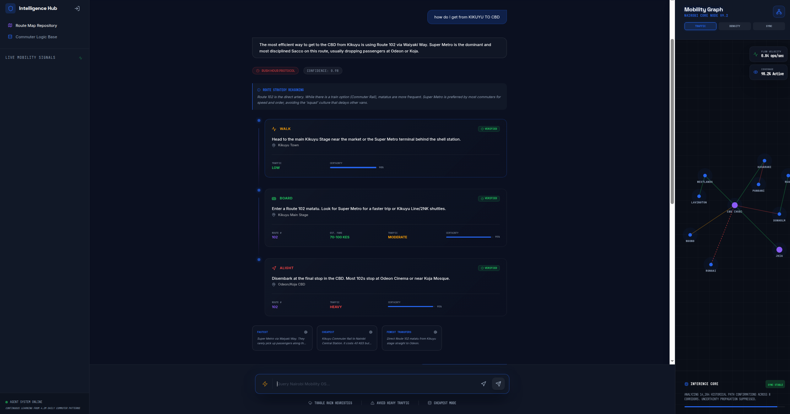
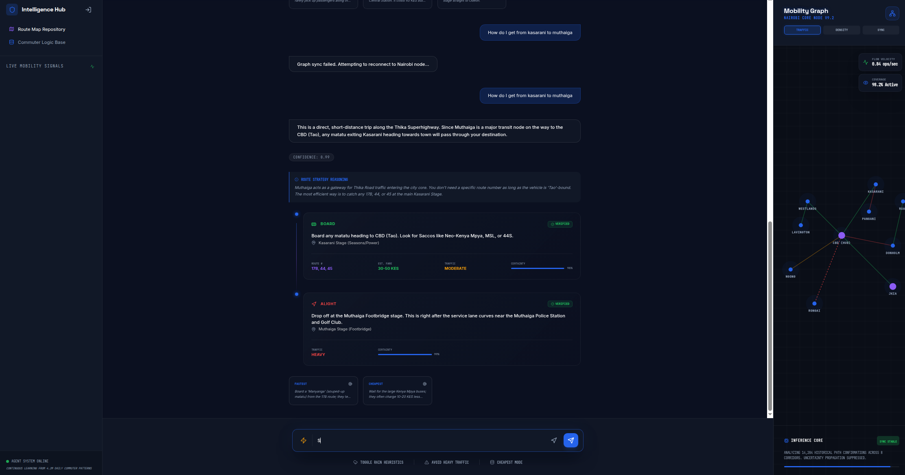

<div align="center">

</div>

# Run and deploy your AI Studio app

This contains everything you need to run your app locally.


Deployed link: https://ais-pre-dudi23en744g4u5bblxwtm-481120172216.europe-west2.run.app/

## Demo Images




## Run Locally

**Prerequisites:**  Node.js


1. Install dependencies:
   `npm install`
2. Set the `GEMINI_API_KEY` in [.env.local](.env.local) to your Gemini API key
3. Run the app:
   `npm run dev`

### The Problem
Navigating Nairobi's informal matatu network is challenging due to the lack of official routing feeds and a heavy reliance on dynamic, culturally-contextual information. Commuters often struggle with complex stage aliases, unwritten rules about weather affecting fares, and unpredictable traffic patterns. Intelligence Hub solves this by acting as a deeply experienced local commuter agent, decoding the chaos to provide accurate, multi-hop routing advice complete with real-time conditions.

### Agent Architecture
- **Core Agent**: Powered by the `gemini-1.5-flash` model via the `@google/genai` SDK, acting as "The Nairobi Transit Virtuoso".
- **Knowledge Grounding**: The agent references a hardcoded `KNOWLEDGE_BASE` for static route and hub awareness.
- **Tools**: It leverages the native `googleSearch` tool and a custom server-side `get_traffic_report` tool to evaluate real-time road conditions.
- **Communication & State**: A React frontend queries an Express backend (`/api/chat`). The backend orchestrates the Gemini API calls (including function executions for tools) and maintains long-term invisible conversation memory using Firebase Firestore.

### Interacting with the Deployed Version
1. Open the application link and click **COMMUTER SIGN IN** to authenticate via Google.
2. Type in your current location and destination (e.g., *"I'm at Kencom and need to get to Roysambu"*).
3. Intelligence Hub will analyze the routes and provide structured advice: the best stage, the Matatu number/SACCO, transfer logic, and live alerts based on real-time traffic.
4. You can toggle the map view to see visualizations of major Nairobi termini (like Railways or Green Park).


## Team Members & Roles

- **Tevin** 
- **Daisy** 
- **MaryAnn** 
- **Fredrick** 
- **Sam** 


## Solution Plan

```
You are designing and implementing the Matatu Route Intelligence Agent — an AI-powered transit reasoning system for Nairobi’s informal public transport network.

This is NOT a normal chatbot.
This is NOT Google Maps.
This is NOT a PDF Q&A tool.

The goal is to build a living transport intelligence system capable of reasoning about Nairobi’s matatu ecosystem using fragmented, inconsistent, crowdsourced, and incomplete data.

BACKGROUND

Nairobi’s matatu system transports over 4 million people daily but has:
- no official GTFS feed
- no reliable public routing API
- incomplete and outdated maps
- informal and evolving stage names
- route variations depending on SACCO, traffic, police activity, weather, and driver behavior
- transit knowledge that mostly exists in human memory

The system must behave like an experienced Nairobi commuter who understands:
- stage aliases
- Nairobi slang
- transfer culture
- route heuristics
- common shortcuts
- dangerous or congested areas
- time-based traffic behavior
- local landmarks

CORE OBJECTIVE

Build an agentic transit intelligence system that can answer queries such as:
- “How do I get from Kawangware to Ruai right now?”
- “What’s the cheapest route from Rongai to Westlands?”
- “How do I avoid Waiyaki Way traffic at 6PM?”
- “Which matatu should I board from CBD to Kasarani?”
- “Can I get to JKIA without passing through heavy traffic?”
- “What’s the fastest route from Karen to Thika Road?”

The system must infer and reason even when:
- routes are incomplete
- stages have multiple names
- data conflicts
- no exact route exists
- users provide vague landmarks instead of official names

KNOWLEDGE SOURCES

The system must combine and reason across:
- route PDFs
- static transport maps
- crowdsourced rider feedback
- SMS reports
- WhatsApp/community updates
- OpenStreetMap data
- inferred route relationships
- historical route patterns
- traffic heuristics
- stage aliases
- landmarks
- road network topology

The PDFs are ONLY one source of intelligence.

The system should continuously improve from:
- user interactions
- rider confirmations
- route corrections
- crowdsourced updates
- inferred graph relationships

SYSTEM CAPABILITIES

The agent must:

1. Decode transport intelligence from messy transport artifacts
2. Extract:
   - routes
   - stages
   - landmarks
   - roads
   - terminals
   - route relationships
3. Build a graph-based transport network
4. Infer missing connections probabilistically
5. Handle slang and ambiguous stage names
6. Support multi-hop routing
7. Estimate:
   - fare ranges
   - transfer difficulty
   - traffic severity
   - route confidence
   - expected travel time
8. Explain routes conversationally like a real commuter
9. Suggest alternate routes when uncertainty is high
10. Learn from new rider input continuously

OUTPUT REQUIREMENTS

Every route response should include:
- boarding location
- matatu route number(s)
- transfer stage(s)
- landmark references
- estimated fare
- estimated travel duration
- traffic warnings
- safety considerations
- confidence score
- alternate options

Example format:

{
  "origin": "Westlands",
  "destination": "Donholm",
  "recommended_route": [
    {
      "route": "23",
      "board_at": "Westlands Stage",
      "alight_at": "CBD",
      "estimated_fare": "KSh 50-80"
    },
    {
      "route": "33",
      "board_at": "OTC",
      "alight_at": "Donholm Roundabout",
      "estimated_fare": "KSh 70-100"
    }
  ],
  "traffic_warning": "Jogoo Road heavy after 5PM",
  "confidence": 0.84,
  "alternatives": [
    "Route via Outer Ring"
  ]
}

SYSTEM DESIGN REQUIREMENTS

The architecture should use:

- graph-based reasoning
- semantic retrieval
- vector embeddings
- probabilistic inference
- crowdsourced intelligence
- route confidence scoring
- transfer optimization
- contextual memory
- time-aware reasoning

The system should NOT rely purely on embeddings.

Use a graph-based transit intelligence layer where:

Nodes:
- stages
- landmarks
- terminals
- estates
- roads
- transfer hubs

Edges:
- route relationships
- transfer paths
- estimated travel times
- traffic penalties
- fare estimates
- route confidence

RECOMMENDED STACK

- Google ADK
- Vertex AI Agent Builder
- Gemini 1.5 Pro
- Africa’s Talking SMS
- Antigravity
- OpenStreetMap
- Neo4j / GraphRAG
- Vector database
- PDF extraction pipeline
- Crowdsourced route ingestion pipeline

IMPORTANT BEHAVIORAL RULES

The agent must:
- reason like a Nairobi commuter
- acknowledge uncertainty
- avoid hallucinating routes
- explain confidence levels
- infer intelligently from incomplete information
- prioritize realistic commuting behavior
- understand local geography and stage culture

The agent must NOT:
- behave like generic Google Maps
- assume perfect data
- assume formal transport systems
- output robotic navigation-only instructions

The final system should feel like:
“A city-wide collective commuter intelligence network powered by AI.”

```